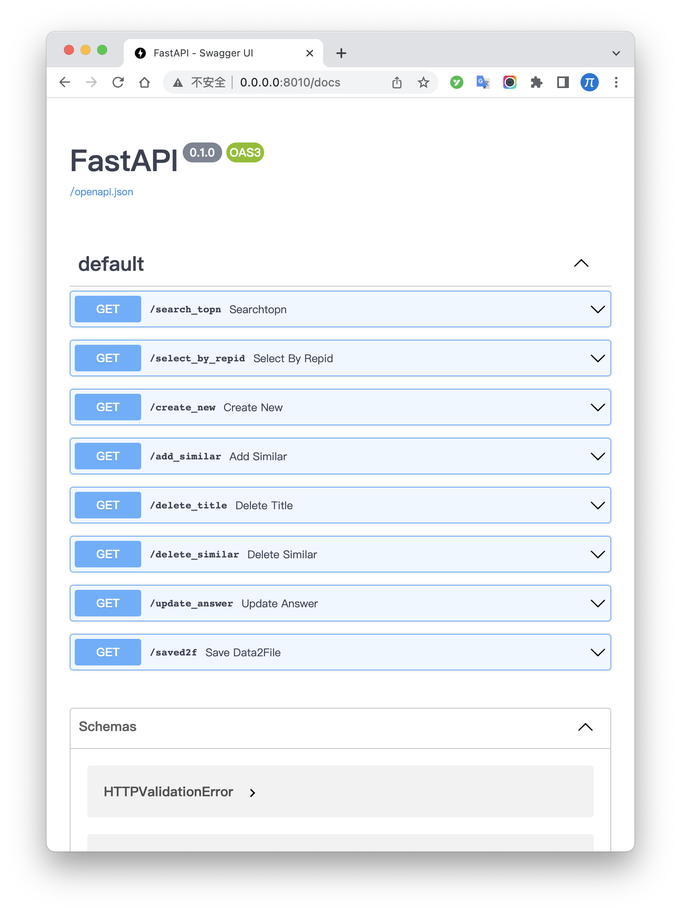
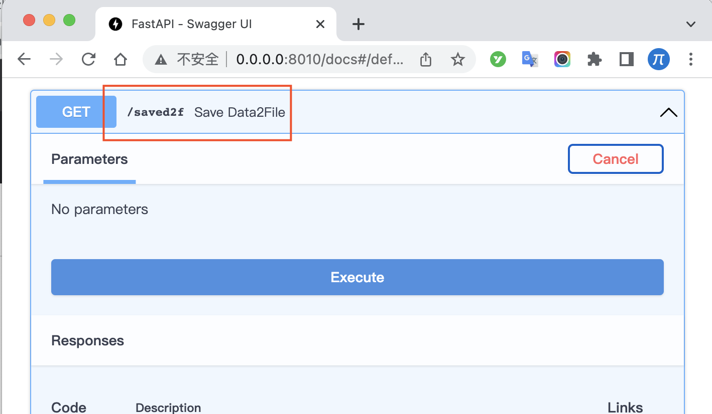

# questionAnswerSystem

## 介绍

本项目是在不借助数据库的情况下：

1. 基于pandas、numpy、pytorch实现数据的curd的（替代数据库的）
2. 基于transformers、sentence-transformers实现文本转向量的
3. 基于fastapi对外暴露接口的
4. 问答机器人。

## 目的

1. 实现一个问答机器人（基于sbert来做）其实是想做搜索，其实我感觉nlp和搜索也都差不多，都是策略问题。
2. 不依赖数据库，实现数据管理的crud。
3. 希望依靠numpy、fastapi能做一个拥有redis功能的数据库（听起来很可笑，我自己也觉得肯定是不可能的，我就是想试一试，提高代码能力）。
4. 在实现的过程中，我希望把整个nlp问答机器人的数据流都打通。数据流打通，至于用什么数据库之类的，都是小事情。

## 实现的功能有什么

1. crud中的R功能，也就是Read。或者干脆就叫搜索吧。起码要有搜索功能
2. crud中的c功能，也就是Create。对应到一个完整的问答机器人，也就是：`创建知识条目`
3. crud中的u功能，也就是update。对应到这个项目里面，也就是：`更新知识条目的答案`、`更新知识条目中相似问法`
4. crud中的d功能，也就是delete。对应到这个项目里面，也就是: `删除知识条目`、`删除相似问法`
5. 其实还有转换功能，实现文本转向量功能。
6. 还有计算相似度功能，主要是基于cos距离
7. 还有分组统计的功能，主要是使用mrr来计算。

## 缺点

1. 没有考虑并发，但其实一般1秒处理100条，基本上不是问题。
2. 应该有很多缺点，大家可以提issue给我。

## 数据结构

一个完整的知识库中的条目，起码要有这三个部分：

1. 标题：这个知识库的标题是什么。一般来说都是文本。
2. 答案：这个是要返回的结果，或者叫答案。一般是文本，有的是接口，我这里不管了，都是文本。
3. 相似问法：相似问法是对标题的补充，尽可能覆盖用户会提问的语句内容。
4. 其实还有别的，比如条目类型、创建时间等，我这里有的就省略了。

我这里采用标题和相似问法剥离的处理方式。把他们分为两个表：

### 程序上的中间表

#### 1. 标题表（pandas保存）

维度有：

1. 标题:`title`
2. 答案:`answer`
3. 创建时间:`create_time`
4. 修改时间:`modify_time`
5. `rep_id`:和`相似问法表`关联
6. 状态:`status_question`: 0代表关闭，1代表激活

#### 2. 相似问法表（pandas保存）

维度有：

1. `rep_id`:和`标题表`问法关联
2. 相似问法:`similarity`
3. 创建时间:`create_time`
4. 修改时间:`modify_time`
5. 状态: `status_similar`: 0代表关闭，1代表激活
6. 索引:`sim_index`

还有两个表：

1. 相似问法的向量：对相似问法做encoding，保存为numpy向量
2. 标题的向量：对标题做encoding，保存为numpy向量

## 硬件要求。

这个对硬件要求不高。唯一要求就是，起码内存要16G以上。

### 常规版本：

我的MacBook pro 16寸的（内存16G，无cuda）

### 高配版本：

1. cpu：12700
2. 内存：64G
3. 显卡：nvidia-3090
4. ubuntu-22.04

## 运行

### step0 安装包

按照requirements.txt的指导，安装对应的包。基本上都是nlp开发者经常用到的包，不需要特别注意

### step1 开启向量引擎后台

`backend_new.py`是整个问答机器人的核心。这个能运行即可。需要等待一段时间，有加载模型数据和初始化知识库的步骤。

细节部分：

1. 对外端口是8010。想要切换的话，直接在代码最后面修改即可。用的就是fastapi，熟悉fastapi的用户，随便怎么改都可以。
2. 等全部的都加载完全之后，在浏览器里面打开：`http://0.0.0.0:8010/docs` 就能看到所以的暴露接口了。

###  step2 如何查询
如何把这个向量搜索引擎用起来呢？可以看看`front_search.ipynb`文件，这里会教你如何查询一个文本，并且提取结果。

### step3 如何管理知识库
在文件`front_admin.ipynb`里面，你可以看到这些内容：
1. 如何创建知识条目
2. 如何删除条目
3. 如何删除相似问法
4. 如何更新答案
5. 如何增加相似问法

## 知识库如何导出
因为你的一切修改，都是在内存里面，如果你的程序结束，那么所有的内容都会消失。比如你维护的知识条目。这个也考虑到了。在`http://0.0.0.0:8010/docs`
你可以看到一个叫`saved2f`接口，运行一下，就会把你的条目放在文件夹`QADIR`里面，一个是相似问法的表，一个是标题的表。

## 如何做微信机器人
1. 目前还在开发微信机器人，就是类似于在群里面聊天的，等后面整理好代码，都会分享出来～

## 相关问题
### 1. 模型加载会失败怎么办?
1. 如果你使用sbert的模型，可以先下载下来，再传递路径，参考链接为: [https://mp.weixin.qq.com/s/avBvs7chURKJSn25OQiqbg](https://mp.weixin.qq.com/s/avBvs7chURKJSn25OQiqbg)
2. 其实常规的transformers模型都可以（注意是pytorch版本的），实在不行把文件下载到离线，然后传递路径即可。
3. 我本质上就是直接使用sentence-transformers包，因此，遇到问题，可以去这个包下面看看。

### 2. 想要提高效率怎么办?
1. 我这个项目不是从效率角度考虑的，因此效率并不是我的考虑重点。
2. 不过想要提高效率，有两个关键步骤需要考虑：
- 2.1 文本转向量的效率，这个可以参考我的仓库：[https://github.com/yuanzhoulvpi2017/quick_sentence_transformers](https://github.com/yuanzhoulvpi2017/quick_sentence_transformers)
- 2.2 在向量搜索的效率，这个可以使用优秀的数据库，比如Elasticsearch、faiss、milvus。这些优秀的库都是基于更加优秀的算法，去查找的。而我只是使用了cos距离、mrr这些东西，简单的计算。
- 2.3 虽然pandas、numpy没有Elasticsearch、faiss、milvus这样的库牛，但是我觉得在大部分场景，都是相当够用了。而且都是开箱即用的。
- 2.4 使用pandas、numpy来做，就是希望对数据流的控制了解地更加深刻，其实更加复杂的内容，也不过是增加更多的算法、更多的数据预处理等。而且这两个包性能在百万级别的数据规模下，效率并不低。

